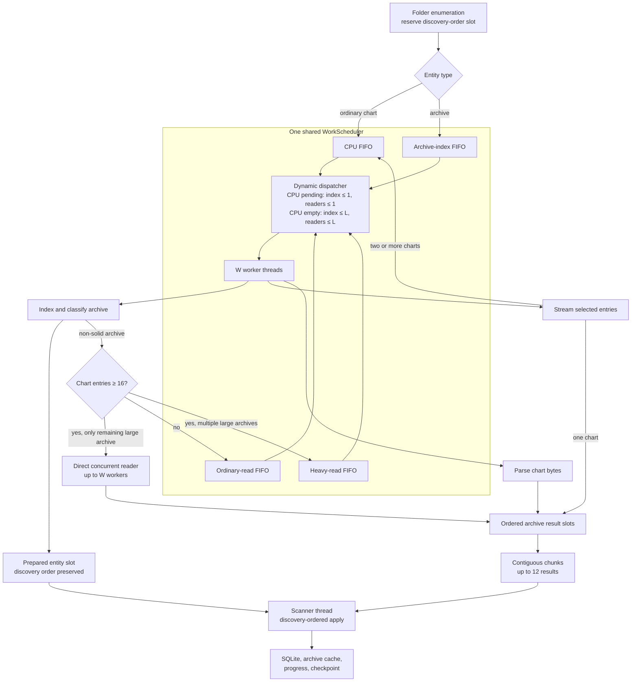

# Chart Scan Work Scheduler

This is the live design reference for the chart-scanning scheduler implemented
by [ChartScanWorkScheduler.h](./ChartScanWorkScheduler.h),
[ChartScanWorkScheduler.cpp](./ChartScanWorkScheduler.cpp), and the pipeline in
[ChartLibraryScanner.cpp](./ChartLibraryScanner.cpp). Update this document when
the worker budget, queue admission, pipeline bounds, or result-reporting method
changes.

The design favors a simple shared pool with dynamic admission. It avoids a
thread pool per archive, keeps ordinary charts moving while archives are
active, and expands archive concurrency when no CPU work is waiting.

## Resource model

For a normal scan:

```text
H = std::thread::hardware_concurrency(), or 4 when it reports 0
W = min(512, H)
L = max(1, W - 1)
A = CPU queue empty ? L : 1
```

- `W` is the total shared worker-pool size.
- `L` is the configured ceiling for each archive lane.
- `A` is the current admission limit for new archive work.
- Archive indexes and archive readers have independent active counters.
- Ordinary and heavy readers share one reader counter.
- The pool itself always bounds total active work to `W`.

The scheduler has four FIFO queues:

| Queue | `WorkClass` | Typical work |
| --- | --- | --- |
| CPU | `Cpu` | Ordinary chart parsing and archive-entry parsing |
| Archive index | `ArchiveIndex` | Open, list, classify, and cache archive metadata |
| Ordinary archive read | `ArchiveRead` | Streams an archive with fewer than 16 chart entries |
| Heavy archive read | `ArchiveReadHeavy` | Streams an archive with at least 16 chart entries |

## Pipeline and scheduling diagram



The diagram shows logical roles. `INDEX`, `READ`, and `PARSE` all execute on the
same `W` threads except for the isolated single-large-archive fast path, which
runs only when the shared scheduler has no queued or active work.

## Dispatch policy

When CPU work is queued, the dispatcher first fills a missing index lane and a
missing reader lane, then selects CPU work. This permits one short index and one
reader to overlap parsing without allowing additional archive work to consume
newly available workers.

When the CPU queue is empty, archive work is work-conserving. Indexes expand up
to `L`, followed by ordinary reads and then heavy reads. Ordinary reads are
selected before queued heavy reads even when the heavy read was queued first.

The admission change is not preemption. Archive work that was already active
continues when CPU work appears; only later admissions use the contracted limit.

Within each queue, enqueue order is preserved. Archive indexes and readers use
independent counters, so a long reader does not consume the short-index lane.
Ordinary and heavy readers share `activeArchiveReads_`, so their combined
configured ceiling is `A`.

### Ten-thread example

The representative device reports ten hardware threads:

```text
H = 10
W = min(512, 10) = 10
L = W - 1 = 9
```

- With CPU work waiting, at most one new index and one new reader are admitted.
- With only reader work waiting, up to nine readers may be active.
- With only index work waiting, up to nine indexes may be active.
- Mixed index and reader work can occupy all ten workers because their counters
  are independent; total activity still cannot exceed the pool size.

## Archive pipeline

Directory enumeration only discovers entities and reserves their ordered result
slots. It does not wait for an archive to finish before discovering later files.

1. An ordinary chart enters the CPU queue.
2. An uncached archive enters the archive-index queue. A valid persisted cache
   can publish preparation metadata without reopening the archive.
3. Index work lists and classifies entries. Solid archives stop here because
   their charts cannot be streamed independently.
4. A non-solid one-chart archive is read and parsed inline by its reader task.
5. A non-solid multi-chart reader streams bytes and submits each chart parse to
   the CPU queue. Per-archive backpressure bounds buffered work.
6. Parsed results occupy fixed entry-order slots. Only contiguous results are
   published, in chunks of 12 or a smaller terminal chunk.
7. The scanner thread consumes archives in discovery order and remains the sole
   owner of SQLite, progress, cache, and checkpoint mutation.

The first archive with at least 16 charts is temporarily held as a possible
single-large-archive candidate. A second large archive releases both into the
shared pipeline. If it remains the only unprepared large archive and the shared
scheduler is idle, the optimized random-access backend may use up to `W` workers
without nesting that pool inside the shared scheduler. If smaller prefetched
archives are still active, the large archive stays on the shared pipeline.

## Ordering and lifecycle invariants

- Discovery order determines entity slots and database application order.
- Workers never mutate the scan database directly.
- A reader may enqueue CPU work after `finish()` is requested. Workers exit only
  when finishing was requested, every queue is empty, and no task is active.
- `cancel()` closes the scheduler, invokes cleanup callbacks for queued work,
  wakes waiters, and then joins all workers. Archive-entry cleanup releases
  pipeline byte/file slots before an active producer is joined, so cancellation
  cannot strand a producer behind discarded parse tasks.
- Task exceptions are captured, the worker remains usable, and exceptions are
  reported after the pool joins.
- A failed or incomplete archive read does not write a completed archive-cache
  record.

## Hard-coded values

| Value | Current setting | Effect |
| --- | ---: | --- |
| Scanner work-item/batch ceiling | 512 | Caps `W` and the fallback ordinary parse batch |
| Unknown-hardware fallback | 4 workers | Used only when `hardware_concurrency()` returns zero |
| Idle archive-lane ceiling | `W - 1`, minimum 1 | Applies independently to indexes and readers |
| CPU-backlog archive admission | 1 per archive lane | Protects CPU work without preempting active archive work |
| Ordinary/heavy boundary | 16 chart entries | Chooses `ArchiveRead` below 16 and `ArchiveReadHeavy` at or above 16 |
| In-flight files | 12 per multi-chart archive | Bounds queued or running entry buffers |
| In-flight bytes | 16 MiB per multi-chart archive | Bounds normal buffered entry data; one oversized entry may enter an empty pipeline |
| Result chunk | 12 charts | Publishes contiguous results incrementally |
| Backpressure/result polling | 20 ms | Rechecks stop state while waiting on condition variables |
| Archive classification pause check | Every 256 entries | Keeps pause and cancellation responsive during indexing |
| Archive checkpoint interval | Every 100 parsed entries | Limits resume replay within an archive |
| Ordinary checkpoint interval | Every 1,000 charts | Limits resume replay for ordinary files |
| Retained parsing-log lines | 1,000 | Bounds the exported diagnostic log |
| Retained idle 7-Zip objects | 4 | An object-cache size, not a worker or active-reader limit |

With `W = 10`, the normal buffered archive-data budget is approximately
`9 * 16 MiB = 144 MiB`, plus at most one oversized entry per active reader and
the parser/result objects. This is a pressure bound, not a reservation.

## Cache behavior during manual rebuild

Manual rebuild deletes persisted `chart_meta`, `solid_archives`,
`archive_scan_cache`, and `chart_scan_checkpoint` rows before scanning. It does
not clear the process-global archive index map or the four-entry idle 7-Zip
object cache. Consequently, a same-process manual-rebuild trace can contain
warm archive indexes or handles and must not be described as a cold-launch run.

## Representative device result

The 2026-07-30 trace compares the previous four-reader policy with the current
full-hardware policy using the same manual-rebuild-to-final-insert metric. Image
loading lines are excluded. Both are same-process manual rebuilds, so the cache
qualification above applies.

| Run context | Value |
| --- | --- |
| Current scheduler commit | `277210a2` |
| Device model | Unavailable in exported trace |
| Hardware/pool/lane values | `H = 10`, `W = 10`, `L = 9` |
| Cache state | Same-process manual rebuild; persisted scan tables cleared |
| Start event | `[8848ms] Manual library rebuild requested` |
| Index split event | Last `Archive chart scan complete` at `[11505ms]` |
| End event | Final `Finished streamed DB chart batch insert` at `[18017ms]` |

| Metric | Previous best | Current policy | Change |
| --- | ---: | ---: | ---: |
| Manual rebuild to final chart-batch insert | 13.353 s | **9.169 s** | **-4.184 s (-31.3%)** |
| Rebuild request to last archive index | 2.328 s | 2.657 s | +0.329 s (+14.1%) |
| Last archive index to final insert | 11.025 s | **6.512 s** | **-4.513 s (-40.9%)** |
| Peak overlapping logged 7-Zip extractions | 4 | **9** | +5 |
| Scanner workers | 6 | **10** | +4 |
| Idle reader ceiling | 4 | **9** | +5 |

The indexing interval did not improve. The result came from the archive
extraction, chart parsing, and ordered insertion tail, which is the phase the
larger pool and removed reader ceiling were intended to accelerate. This is one
representative-device trace, not a local benchmark.

### Workload composition

The archive profile below is reconstructed from the 51
`Archive chart scan complete` records. Compressed-size buckets use the log's
integer human-readable sizes, so the 64.2 GiB sum is approximate. Estimated
unpacked bytes and contained-file/chart counts are emitted as exact integers.

| Discovered input entity | Count in timed run | Size profile |
| --- | ---: | --- |
| Archive files | **51** | Available below |
| Ordinary chart files | **Unavailable** | Not emitted by this build |
| Total input entities | **Unavailable** | Cannot be derived without the ordinary count |

| Archive format | Count | Share |
| --- | ---: | ---: |
| 7z | 37 | 72.5% |
| ZIP | 11 | 21.6% |
| RAR | 3 | 5.9% |
| **Total** | **51** | **100%** |

| Displayed compressed size | Archive count | Share |
| --- | ---: | ---: |
| Less than 1 MiB | 5 | 9.8% |
| 1 MiB to less than 16 MiB | 6 | 11.8% |
| 16 MiB to less than 128 MiB | 32 | 62.7% |
| 128 MiB to less than 1 GiB | 3 | 5.9% |
| 1 GiB to less than 8 GiB | 2 | 3.9% |
| 8 GiB or larger | 3 | 5.9% |

| Chart candidates per archive | Archive count | Share |
| --- | ---: | ---: |
| 0 or 1 | 4 | 7.8% |
| 2 to 15 | 14 | 27.5% |
| 16 to 63 | 23 | 45.1% |
| 64 to 255 | 7 | 13.7% |
| 256 or more | 3 | 5.9% |

Additional archive totals:

- approximately 64.2 GiB displayed compressed size;
- 76.419 GiB estimated unpacked size;
- 876,245 contained non-directory files; and
- 7,040 candidate chart entries.

#### Ordinary chart files

| Ordinary-file measure | Value |
| --- | --- |
| Discovered chart-file count | **Unavailable** |
| Total file size | **Unavailable** |
| Size distribution | **Unavailable** |
| Extension distribution | **Unavailable** |

The exported build did **not** log the ordinary-file discovery total, sizes, or
extensions. At least one ordinary BMS file is visible in the trace, but an exact
count cannot be reconstructed. These fields must therefore be recorded as
**unavailable**, not inferred as zero. This is the main limitation of this
result's workload description.

### Required context for future results

Every result added here must include:

1. commit, device, `H`, `W`, and `L`;
2. cold launch versus same-process manual rebuild;
3. ordinary chart count, total bytes, extension distribution, and file-size
   distribution;
4. archive count by format, total compressed bytes, compressed-size
   distribution, contained-file total, and chart-candidate distribution;
5. the precise start and end log events used for timing;
6. peak archive concurrency when the trace exposes it; and
7. unrelated image/audio loading excluded from the parsing result.

If a trace does not emit one of these fields, mark it unavailable and avoid
using the run as a normalized comparison until the missing workload profile is
captured.

## Regression coverage

`chart_scan_work_scheduler_tests` protects the resource model and lifecycle,
including:

- full use of a reported hardware-thread count;
- six simultaneous archive reads from a seven-worker default scheduler;
- CPU-backlog contraction;
- independent index progress;
- ordinary-read priority over queued heavy reads;
- work enqueued by an active task after `finish()` begins;
- exception containment; and
- cancellation and joining.

`chart_library_scanner_tests` covers mixed ordinary/archive scans, concurrent
archive inspection, streaming overlap, ordered application, cache behavior,
checkpoint resume, stop, and pause behavior.
